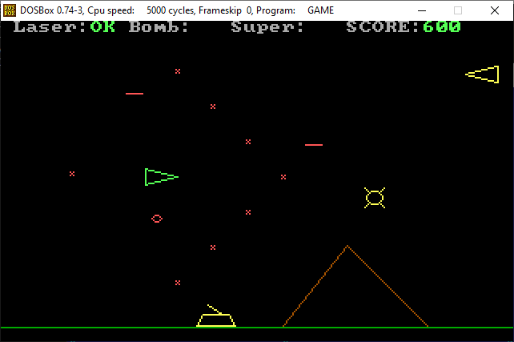
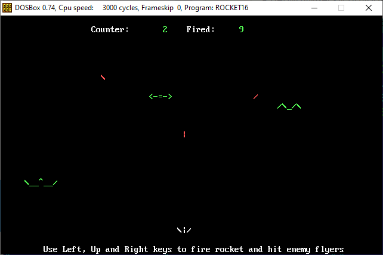

# Лаборатория разработки игр для 16-битного реального режима процессора x86 и операционной системы DOS/FreeDOS

**Внимание:** Данный репозиторий не является сборников завершенных игр или
иных проектов, это именно экспериментальная площадка для изучения возможностей
различных компиляторов, библиотек, публикации наработок и сохранения удачных
рецептов и скриптов, а также отчетов.

Исходные коды проектов могут содержать множество недочетов, а также явных
ошибок, не рекомендуется использовать их иначе, как в учебно-исследовательских
целях.

Официальный канал о разработке 16-битных игр для реального режима x86 - https://t.me/gamedev16bit

# Game Development lab for 16-bit real mode x86 processor and DOS/FreeDOS operating system

**Attention:** This repository is not a collection of completed games or
other projects, it is an experimental platform for exploring the possibilities
of various compilers, libraries, publishing developments and saving successful
recipes and scripts, as well as reports.

The source codes of projects may contain many flaws, as well as obvious
errors, and it is not recommended to use them except for educational and research
purposes.

## Состав репозитория

* Каталог games - содержит подкаталоги прототипов и набросков игр, с их скриптами сборки
* Каталог tests - содержит простые примеры исходников для отдельных компиляторов, а также скрипты сборки
* Каталог examples - несортированный сборник примеров кодов
* Каталог docs - несортированный сборник заметок о компиляторах, сборке, отчетах и ошибках

В релизах репозитория содержатся бинарные сборки проектов из каталога `games`,
в архиве для DOS/FreeDOS и в архиве с настроенным DOSBox для запуска под Windows.

В issue репозитория могут включаться как найденные ошибки/проблемы проектов,
так и пожелания/идеи по их улучшению.

## Прототипы игр

### bomber

Пробный проект на ASIC BASIC.

Для сборки нужен ASIC Basic 5.0, его библиотека ASI5LIB.LIB и ассемблер NASM
для DOS. ASIC устанавливается в DOSBox в каталог `C:\ASIC`, NASM - `C:\NASM`

Состав проекта:
* GAME.ASI - код игры
* helpers.asm - файл с ассемблерной процедурой очистки экрана для режима 7
* buildasm.bat - скрипт сборки исходника на ассемблере, запускается первым
* build.bat - скрипт сборки исходника на Бейсике, запускается вторым

Перед сборкой нужно скопировать файл `ASI5LIB.LIB` в каталог `C:\ASIC`

### rocket

Пробный проект на NASM.

Для сборки нужен ассемблер NASM в каталоге`C:\NASM`. Можно использовать как под
DOS/FreeDOS, так и в режиме кросскомпиляции.
Используем модель памяти TINY и формат COM.
Для работы игры в DOS/FreeDOS или в виртуальной машине нужен установленный
драйвер ANSI.SYS. Запуск в DOSBox выполняется без дополнительных драйверов.

Состав проекта:
* rocket16.asm - код игры
* proc.asm - файл с процедурами
* build.bat - скрипт сборки

# survive

Пробный проект на C и кросс-компилятором DigitalMarsCompiler(DMC). 

Требует установленного DMC в каталоге `C:\DM`. Использовать можно только
как кросс-компилятор. Для сборки используем модель памяти MEDIUM.
Использует ассемблерные вставки. Исходно портирован с версии игры
для компьютера БК-0010 в целях освоения написания на C под 16бит.

Настройки по ключам:
https://digitalmars.com/ctg/sc.html

Информация по RTL:
https://digitalmars.com/rtl/rtl.html

Состав проекта:
* survive.c - код игры
* const_en.h - текстовые константы
* gameapi.h - заголовки для игровых функций (графика, звук, клавиатура, таймер)
* gameapi.c - реализация игровых функций
* build.bat - скрипт сборки для кросс-компиляции
